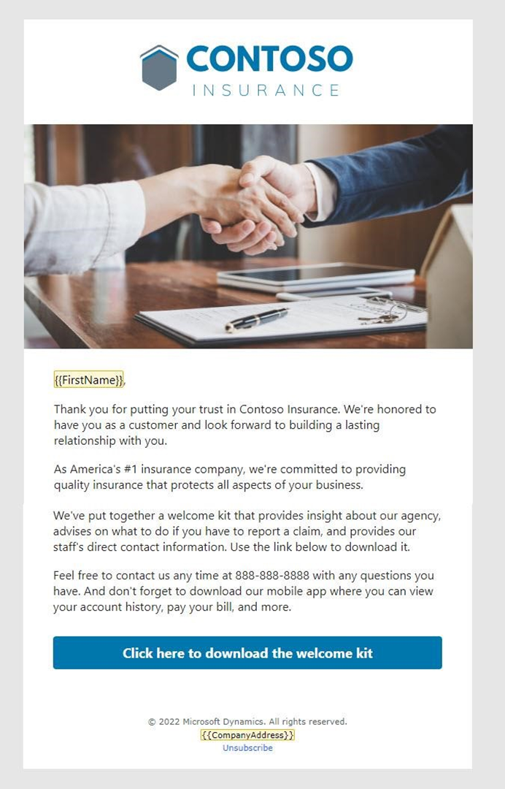

---
lab:
  title: 'ラボ 1: メールを作成する'
---

## ラボ 1: メールを作成する 

このラボでは、以下の方法について説明します。
- 体験で使用するメールを作成する
- アップロードしたアセットをメールで使用する
- メール コンテンツを確認して公開する

### タスク 1: 最初のメールを作成する
1. Dynamics 365 Customer Insights - Journeys にログインします。

1. **リアルタイム体験**の作業領域に移動します。

1. [チャネル] で、**[メール]** を選択します。

1. メールを作成する
   - **[+ 新規]** をクリックして、新しいメールを作成します。
   - テンプレート ギャラリーで、**スキップ**を選択します。

1. メールに関する詳細情報を入力します。
   - 名前: ウェルカム メール 1
   - 件名: Contoso Insurance へようこそ
   - プレビュー テキスト: 私たちは質の高い保険を提供することに尽力しています。

1. ブランド プロファイルとして [既定のブランド プロファイル] を選択します。

1. **[設定]** に移動し、**[コンプライアンス]** を展開します。 目的が **[商用]** に設定されていることを確認します。

1. メールをデザインします。 セットアップ手順でアップロードしたヒーロー画像を使用し、デザインとコンテンツのアイデアについては、下のウェルカム メール 1 のスクリーンショットを参照してください。 画像とコンテンツは必要に応じて変更できますが、このメールに行動喚起のボタンを含めてください。この体験内の分岐条件として使用するためです。

 

1. このメールのサンプル コピーを次に示します。 これをコピーしてメールのデザインに貼り付けることができます。 **カスタマイズ**を使用して、連絡先の名の動的なコンテンツを入力します。 

    ```
    {{FirstName}},
    
    Thank you for putting your trust in Contoso Insurance. We're honored to have you as a customer and look forward to building a lasting relationship with you. 
 
    As America's \#1 insurance company, we're committed to providing quality insurance that protects all aspects of your business. 
 
    We've put together a welcome kit that provides insight about our agency, advises on what to do if you need to report a claim, and provides our staff's direct contact information. Use the link below to download it. 
 
    Feel free to contact us any time at 888-888-8888 with any questions you have. And don't forget to download our mobile app where you can view your account history, pay your bill, and more. 
    ```

1. メールにボタンを追加します。 

    - ツールボックスで、**[要素]** タブを選択します。 
    - メイン テキストの下にボタンをドラッグします。 
    - URL を contoso.com に変更します。 
    - [スタイル] セクションを展開します。 
    - ボタンの色を #0076ad に変更します。 

1.  メールをプレビュー、テスト、公開します。 

    - メールの **[プレビューとテスト]** タブに移動して、メールを確認します。 
    - **テスト送信**を使用して自分宛にコピーを送信します。 自分の個人用メール アドレスを入力します。 以前に作成した連絡先を選択します。カスタマイズによって、この連絡先の名が入力されます。 受信トレイにメールが表示されない場合は、迷惑メール フォルダーを確認してください。 
    - 最後の変更を行います。 
    - **[内容の確認]** をクリックします。 必要に応じてエラーを修正します。 
    - **[送信準備完了]** をクリックします。 

### タスク 2: 2 番目のメールを作成する
作成したメールをコピーして、さらに 2 つのメールを作成します。

1. ウェルカム メール 1 が開いている間に、**[保存]** の横にあるドロップ ダウンをクリックして、**[名前を付けて保存]** を選択します。

1. メールの名前を **ウェルカム メール 2** に更新します。 

1. **保存して閉じる**をクリックします。

1. ポップアップで **[レコードの表示]** を選択して、新しく作成したメールに移動します。 (ポップアップが表示されない場合は、**[メール]** に移動して、**ウェルカム メール 2** を選択します。)

1. 件名とプレビュー テキストを変更します。
    - 推奨される **件名:** Contoso Insurance ポータルへのオンデマンド アクセスを取得します。
    - 推奨される**プレビュー テキスト:** アカウント情報、ポリシーの詳細、要求の送信などを確認します。

1. メールをデザインします。 デザインとコンテンツのアイデアについては、下のウェルカム メール 2 のスクリーンショットを参照してください。 必要に応じて、画像とコンテンツを変更できます。 

 

1. このメールのサンプル コピーを次に示します。 これをコピーしてメールのデザインに貼り付けることができます。 (注: FirstName は最初のメールからそのまま残して、残りのコピーをこれに置き換えることをお勧めします)。 

    ```
    I would like to welcome you to the Contoso family! Our specialists are here to help you with all your insurance needs. We also encourage you to setup your Contoso Insurance online account to gain 24/7 access to:  
        -   Your account information and policy details. 
        -   Submit a request for coverage verification, start a claim, or review prior claims. 
        -   A secure and encrypted internal messaging tool for sharing sensitive information. 
    Feel free to contact me with any questions you have. 
        
    Cheers, 
    John Smith, Insurance Specialist   jsmith@contosoinsurance.com 
    888-888-8888 

1. Preview, test, and go live with your email.

### Task 3: Create your third email
We will create one final email by copying email 2.

1. Create a new email by copying email 2. Name the email Welcome email 3. 

1. Enter details about the email.
    - Suggested **Subject:** Welcome to Contoso
    - Suggested **Preview text:** Review your welcome information.

1. Design the email. Refer to the screenshot of Welcome Email 3 below for design and content ideas. You can modify the images and content as desired. 

 

1. Here is sample copy for this email. You can copy and paste this into your email design. (Note: We recommend leaving FirstName from the first email and then replacing the rest of the copy with this.) 

    ```
    Contoso Insurance に信頼を寄せていただき、ありがとうございます。 お客様をお迎えできて光栄です。お客様との永続的な関係を構築することを楽しみにしています。 ウェルカム キットは、当社の代理店に関する分析情報を提供し、要求を報告する必要がある場合の対応についてアドバイスし、スタッフと直接連絡が取れる連絡先情報を提供します。 

    以下のリンクを使用して、当社の Web サイトからキットをダウンロードしてください。
    
    ご質問がある場合は遠慮なくお問い合わせください。 どうぞよろしくお願いいたします。John Smith、保険の専門家   jsmith@contosoinsurance.com 888-888-8888 

1. メールのボタンを更新します。 **ボタン テキスト** フィールドで、**ウェルカム メール用にここをクリック**して変更します。

1. メールをプレビュー、テスト、公開します。
